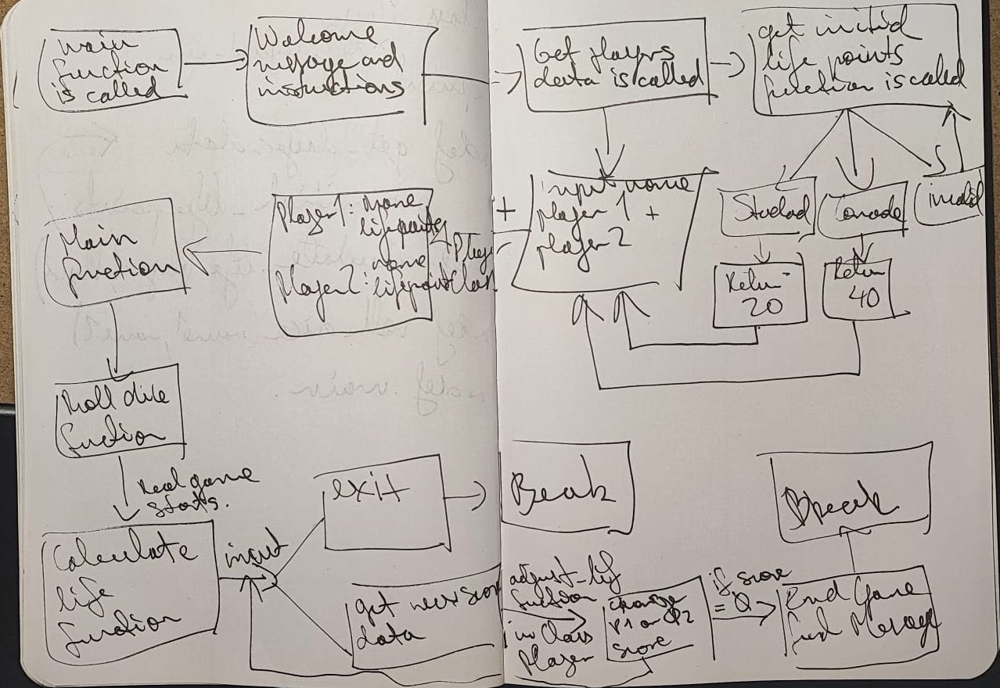
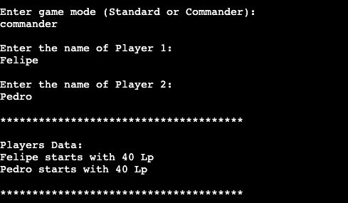

# Magic Life Counter

As a Magic: The Gathering (from now MTG) player, we all know how difficult it is to keep track of points in a game as dynamic as this.

Sometimes games can last many plays, where both players can gain and lose life during both turns. When this happens over a long period of time it is difficult to keep track of life points. For this reason Magic Life Counter becomes very useful and a great tool for every MTG player, casual or experienced.

link to the app:

https://mtg-counter-fcc3885f1dd8.herokuapp.com/

## Development

This idea began with notes in a notebook, which led to summarizing the application into 4 main functions that, through the use of a class, update the life point counter until one of the two reaches 0.

Thanks to technology you do not have to interpret my disastrous handwriting and we can visualize this:

in a much more readable version:

This concept map summarizes in a simple way the process in which the application works and delivers results until it is either deliberately terminated or one of the players loses when their lives end.

## Features

### Welcoming and Instructions

- A welcome message and a drawing of a skull are displayed when starting the application, this directly presents the purpose of the program.

- Instructions are displayed to explain the steps to create each player object with their respective name and life points, wich can be 20 or 40 depending the mode of game the users are playing.

### Roll dice

- In MTG is customary to roll a die at the beginning of each game to decide which player will make the first move. The highest number starts and if both roll the same number, the die is rolled again.

### Start Game

- After rolling the die the game starts and the program is ready to collect the scores from each player. As in MTG a player can earn or lose life points during his or opponent turn, the terminal doesn't go by turns and just collect data and delivers the updated scores.

### End Game

- The game loops and continues delivering the scores until one of each players reach 0 life points or the user types "exit"

## Code

### Player class

- I thought this was a good opportunity to use the classes and methods as all players have the same features and values.

- The player object has 2 instance attributes which are name and initial life score, wich are given by the get_players_data function inputs.

- It also has one method called adjust_life to calculate the new life score after gaining or losing points, wich are called by the calculate_life function.

### Main function

- When the main function is called, it first prints several introductory texts in the terminal explaining the functionality of the app. 

- The first function to be invoked is the get_players_data, wich starts running a nesting function called get_initial_life_points that thru an input delivers the first atribute necessary for the Player class wich is the life points data. Then 2 inputs are shown to get both players name and finally return 2 objects called player1 and player2.

- After recieving the 2 players objects it prints the initial data of both and calls the roll_dice function which after printing its value in the terminal gives turn to the calculate_life function wich is the main functionability of the app and where the program ends.

### Get_players_data function

- An initial input in a while loop from a nested function is shown to collect the mode choosen and return one of both options and store it in a variable.

- Then 2 inputs collect the players names and with this variable and the previous one we can create our Player class objects wich requires this 2 instance attributes respectively.

### Roll_dice

- This is a very simple function wich is called after the get_players_data function, it was necesary to inport the random feature and it creates 2 variables wich deliver 2 random integers with parameter from 1 to 6 and compares them. If they are the same number it runs again until it returns 2 different integers.

- It acepts 2 parameter (players names) to personalize the printed string giving each one a die value.

### Calculate_life

- Calculate_life is the last function from the main function and it starts with an input in a while loop to collect the data separated in name and score as there is in the Player object wich are the 2 parameters that it acepts.

- It gives the option to exit the app if the user types "exit" and if not it acepts one of both players names and the addition or substraction of points.

- Then a statements checks if the name given in the input fits with one of the previous given and then it runs the adjust_life method inside the Player class wich acepts the new_score parameter and calculates the updated life score.

- The updated score is printed along witch the other player previous score and the function runs again until one of both reach 0 or less, wich lead to a final message which ends up giving victory to the opponent and breaking outside the function and the main function ends.

### Future features

- Adding the option for more than 2 players as MTG can be played in multiplayer.

- Giving counters to each player to keep track of the other aspects of the game.

- Link a sheet to deploy the final scores of the players so there is record of foreplay.

## Testing

- Tested in the Gitpod terminal and in the Heroku app given by Code Institute and in both it runs without errors.

- Errors or invalid inputs given are taking care with statements.

- It passed the PEP8 Python Validator without errors.

## Deployment

link to the Heroku app:

https://mtg-counter-fcc3885f1dd8.herokuapp.com/

- After creting an account in Heroku and linking it with Github is necessary to create a new app in the main menu and give it an unique name.

- In Setting is neccessary to give a key of PORT with value of 8000 to be able to run the code in Herokus app.

- Add the buildpacks of python and nodejs.

- Find the code file in Github and deploys from main.

- This app is connceted for automatic deploys.

## Credit 

- For showing me how to create a dice function:
https://stackoverflow.com/questions/44008489/dice-rolling-simulator-in-python 

- For giving me the parameters to start the program
(Let's code a beginner's Python BANK PROGRAM):
https://www.youtube.com/watch?v=8aW3tkIul-8

- To tomik-z-cech for the PP3-Fallout-Hangman deployed github project for showing me what can be done.

- To https://www.asciiart.eu/ for the skull draw.

